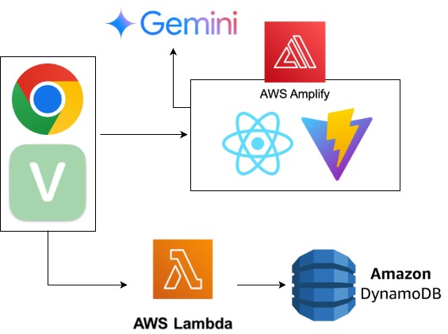

# ほめらぶ


# 概要
homeloveは、ユーザーが日々の活動記録を保存し、その活動に応じて可愛いキャラクターが褒めてくれることでモチベーションを向上させるアプリです。ユーザーは学習時間や活動内容を記録し、記録に基づいて生成された褒め言葉をテキストで確認したり、音声で聞くこともできます。

# 主な機能
- **活動記録の保存**
<br>ユーザーは日付、学習時間、活動内容を入力して活動を記録できます。記録された活動はDynamoDBに保存されます。
- **可愛いキャラクターが褒めてくれる**
<br>記録された活動内容に基づいて、Gemini APIを使用して褒め言葉を生成します。
- **合成音声による読み上げ**
<br>生成された褒め言葉を音声合成し、ユーザーに再生します。
- **活動記録の表示**
<br>保存された活動記録を一覧表示し、学習時間に応じたバーで視覚的に表示します。
- **キャラクターが動く**
<br>自然な感じでキャラクターが動きます

# 技術スタック



- **React**
再利用可能なUIコンポーネント
- **Vite**
高速な開発サーバー、ホットリロード
- **AWS Lambda**
サーバーレスアーキテクチャを採用し、スケーラブルでコスト効率の高いバックエンドを実現。
- **Amazon DynamoDB**
高速でスケーラブルなNoSQLデータベースを使用し、ユーザーの活動記録を効率的に保存、取得。
uuidライブラリでidを管理
- **AWS Amplify**
Amplifyでデプロイ
- **VOICEVOX ENGINE**
音声合成APIで生成された褒め言葉を音声合成し再生。
- **Google Generative AI（Gemini API）**
ユーザーの活動内容に基づいて、可愛い褒め言葉を生成。

# ローカルでの実行方法
1. リポジトリをクローン
```bash
git clone
```
2. ディレクトリに移動
```bash
cd homelove
```
3. 環境変数を設定
<br>`.env`ファイルを作成し、以下の環境変数を設定してください。
API_KEYにはGoogle Generative AI（Gemini API）のAPIキーを設定してください。
```bash
VITE_GEMINI_API_KEY=API_KEY
```
4. VOICEVOX ENGINEの起動
<br>VOICEVOX ENGINEのソフトを起動してください。
インストールがまだの場合は、[こちら](https://voicevox.hiroshiba.jp/)からインストールしてください。
5. 依存関係をインストール
```bash
npm install
```
6. ローカルでアプリケーションを実行
```bash
npm run dev
```

# クレジット表記

この「ほめらぶ」では、フリー素材キャラクター「つくよみちゃん」（© Rei Yumesaki）を使用しています。

[■つくよみちゃん公式サイト](https://tyc.rei-yumesaki.net/)

■イラスト素材：えみゃコーラ様（[配布URL](https://tyc.rei-yumesaki.net/material/illust/)）

■音声合成ソフト：[VOICEVOX ENGINE](https://voicevox.hiroshiba.jp/)